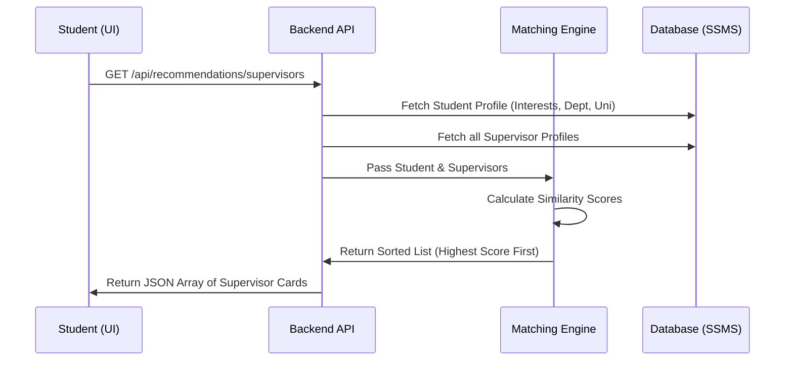

# Supervisor Recommendation System Design

This document covers **Task 1** of Sprint 2: Designing the data flow and matching criteria for recommending supervisors to students.

## 1. Data Flow Architecture

The data flow dictates how a student interacts with the system to receive AI-powered or logic-powered supervisor recommendations.



## 2. Matching Criteria & Scoring Logic

To ensure a student gets the most relevant supervisors, we will use a **Weighted Point System** to calculate a "Match Score" between a Student and a Supervisor.

### The Algorithm
For every supervisor in the database, calculate a score against the current student based on these rules:

1. **Research Interests Match (Primary - Heavy Weight)**
   * Currently, `Interests` are stored as a comma-separated string in `UserProfile.cs`.
   * **Rule:** Split the strings by comma. For every matching keyword (case-insensitive), add **+10 Points**.
2. **Department Match (Secondary)**
   * **Rule:** If `Student.Department == Supervisor.Department`, add **+5 Points**.
3. **University Match (Tertiary)**
   * **Rule:** If `Student.University == Supervisor.University`, add **+2 Points**.
4. **Availability (Filter/Bonus)**
   * **Rule:** We should add an `IsAcceptingStudents` boolean flag to the supervisor's profile. If `false`, the supervisor is completely excluded from recommendations.

### Example Scenario
- **Student Profile:** Interests: "Machine Learning, Computer Vision, Robotics", Dept: "CSE", Uni: "MIT"
- **Supervisor Profile:** Interests: "Machine Learning, Data Science", Dept: "CSE", Uni: "MIT"
- **Score Calculation:** 
  - Match on "Machine Learning": +10
  - Match on Dept "CSE": +5
  - Match on Uni "MIT": +2
  - **Total Match Score:** 17

## 3. Required Database Changes (For Task 2)
To make this work efficiently, we need a minor update to the `UserProfile` model in `backend-dotnet/Models/UserProfile.cs`:
- Add `public bool IsAcceptingStudents { get; set; } = true;`

## 4. API Contract (For Task 3)

**Endpoint:** `GET /api/recommendations/supervisors`
**Headers:** `Authorization: Bearer <JWT_TOKEN>`
**Response:**
```json
[
  {
    "userId": 42,
    "fullName": "Dr. Alan Turing",
    "department": "CSE",
    "university": "MIT",
    "matchedInterests": ["Machine Learning"],
    "matchScore": 17,
    "bio": "Researching AI and compute...",
    "profileImageUrl": null
  }
]
```
